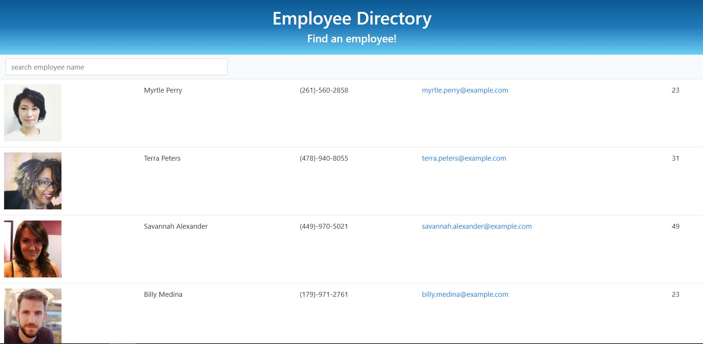
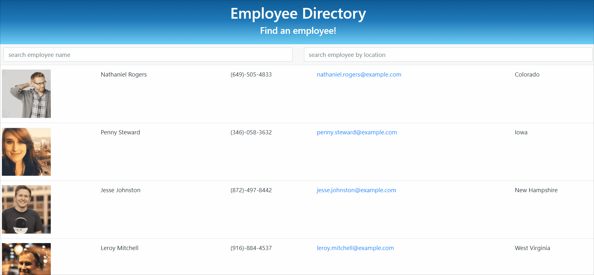

# Employee Directory  💼👔

Users can filter employees within this employee directory by either first name, last name, or location. Simply search an employee using the input box and the table will begin to filter.

An employee or manager would benefit greatly from being able to view non-sensitive data about other employees. It would be particularly helpful to be able to filter employees by name.


# Deployed Application

Try it out!

[Employee Directory](https://third-wave-coffee-app.herokuapp.com/)


# User Story

> As a USER, I want to be able to view my entire employee directory and filter by name and location and obtain their information.


# Acceptance Criteria

```
GIVEN I want to find an employee by name
WHEN I filter by name
THEN I will be presented with employees with that name

GIVEN I want to find an employee by location
WHEN I filter by location
THEN I will be presented with employees at the specified location

```

# Technologies

- Bootstrap
- Express
- HTML & CSS
- JavaScript
- jQuery
- Node.js
- NPM:
  - axios
  - concurrently
  - if-env
  - nodemon
  - react
  - react-dom
  - react-router-dom
  - react-scripts
- Random User API
- REACT

# Preview






