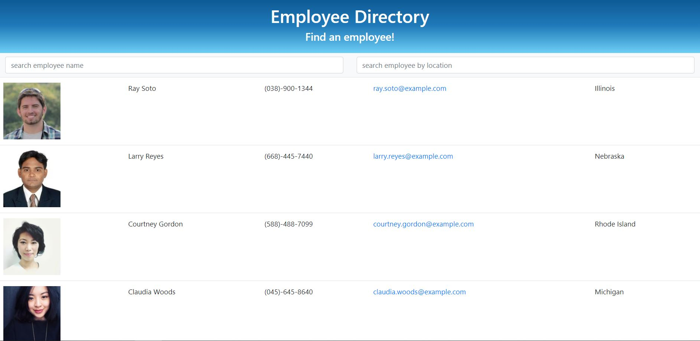

# EmployeeDirectory

## Overview

Users can filter employees within this employee directory by either first name, last name, or location. Simply type in the input box and the table will begin to filter.

## User Story

* As a user, I want to be able to view my entire employee directory at once so that I have quick access to their information.

## Business Context

An employee or manager would benefit greatly from being able to view non-sensitive data about other employees. It would be particularly helpful to be able to filter employees by name.

## Employee Directory

## Technology 
* React
* Axios
* HTML
* CSS
* React-Dom
* Random User API
* JSX

